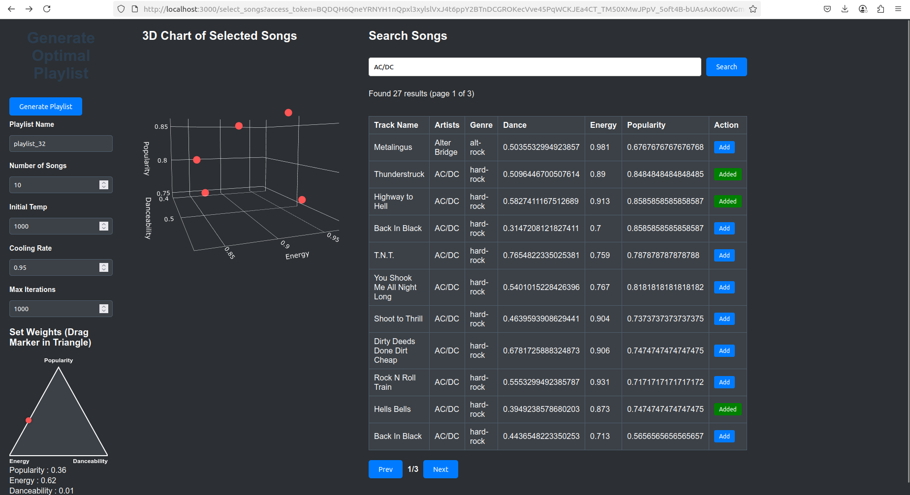

# Playlist Generator

The Playlist Generator makes playlists. It uses a simulated annealing algorithm to find songs. The backend uses Python and Flask. The frontend uses React. The application connects to the Spotify API.

## Preview

Main site with functionality of setting weights (populatiry, energy, danceability). Option to add certain songs to set a mood of a playlist.




Result site with generated playlist and objective function graph.


## Requirements

You must have these tools to operate the application:
* Python 3
* Node.js
* A Spotify Developer account

## Install the application

1. Download the repository.
2. Open a terminal window.
3. Install the Python dependencies.
   `pip install -r requirements.txt`
4. Go to the `frontend` directory.
5. Install the Node.js dependencies.
   `npm install`

## Configure the application

1. Make an application in the Spotify Developer Dashboard.
2. Get the Client ID and the Client Secret.
3. Set the Redirect URI to `http://localhost:5000/callback`.
4. Make a `.env` file in the main directory.
5. Add your Spotify credentials to the `.env` file.
   ```text
   SPOTIFY_CLIENT_ID=your_client_id
   SPOTIFY_CLIENT_SECRET=your_client_secret
   ```

## Start the application

1. Open a terminal window.
2. Start the Flask backend.
   ```bash
   python app.py
   ```
3. Open a second terminal window.
4. Go to the `frontend` directory.
5. Start the React frontend.
   ```bash
   npm start
   ```
6. Open a web browser.
7. Go to `http://localhost:3000`.